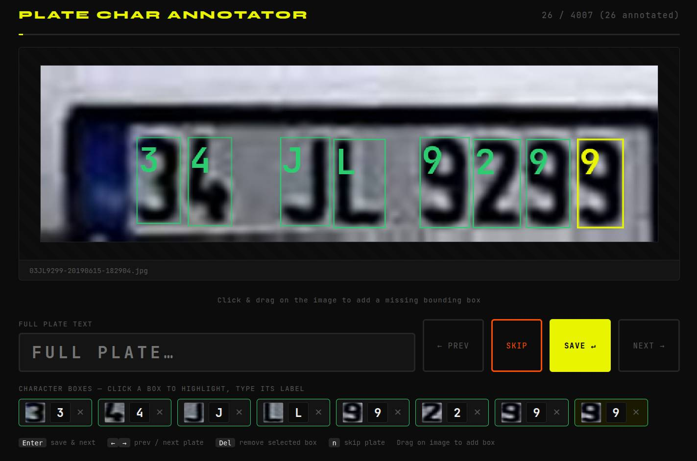

# PlakaTrainer



A pipeline for building Turkish license plate character training data from raw images.

## Pipeline Overview

```
01_detect_plates.py  →  annotate_chars.py  →  training data (output/)
     (ONNX)               (Flask web UI)
```

1. **Detect** — YOLOv8 ONNX model finds plates, crops and deskews them into `deskewed/`
2. **Annotate** — Flask web annotator auto-segments characters per plate and lets you label each one
3. **Output** — Per-character labeled crops saved to `output/` ready for CNN training

## Files

| File | Purpose |
|---|---|
| `01_detect_plates.py` | ONNX plate detection, crop + deskew → `deskewed/` |
| `annotate_chars.py` | Flask web annotator for character labeling |
| `annotater.py` | Earlier annotation utility |
| `02_extract_digits.py` | Legacy: Tesseract-based character extraction |
| `03_review_digits.py` | Legacy: OpenCV review/reclassify tool |
| `kareplaka.onnx` | Trained YOLOv8 plate detector |
| `annotations.csv` | Saved character annotations |
| `debug_seg.py` | Visual pipeline debugger (saves step images to `debug_seg/`) |

## Requirements

```bash
python3 -m venv ../venv
source ../venv/bin/activate
pip install -r requirements.txt
```

Python packages (`requirements.txt`):
- `onnxruntime`
- `opencv-python`
- `flask`
- `numpy`

## Step 1 — Detect & Deskew Plates

Runs the ONNX detector on a folder of images, crops each detected plate, corrects tilt, and saves to `deskewed/`:

```bash
python 01_detect_plates.py --input-dir /path/to/images --output-dir .
```

Options:

| Flag | Default | Description |
|---|---|---|
| `--input-dir` | required | Folder of source images |
| `--model-path` | `kareplaka.onnx` | ONNX model file |
| `--output-dir` | `.` | Parent of `deskewed/` output folder |
| `--confidence-threshold` | `0.25` | Detection confidence cutoff |
| `--max-angle` | `15.0` | Max deskew correction angle (degrees) |

Output: `deskewed/*.jpg` — one file per detected plate.

## Step 2 — Annotate Characters

Launches a Flask web UI to label characters in each deskewed plate:

```bash
python annotate_chars.py --input ./deskewed/ --output ./output
```

Options:

| Flag | Default | Description |
|---|---|---|
| `--input` | `./deskewed` | Folder of deskewed plate images |
| `--output` | `./output` | Destination for labeled character crops |
| `--port` | `5000` | HTTP port |

Open [http://localhost:5000](http://localhost:5000) in a browser.

### Annotator Features

- Auto-segments characters using a histogram + contour pipeline
- Click & drag on the plate image to add missing bounding boxes
- Click a box thumbnail to select it, then type the character label
- `Enter` — save & next plate
- `←` / `→` — prev / next plate
- `Del` — remove selected box
- `n` — skip plate

### Character Segmentation Pipeline

1. **Flood-fill inner rect** — heavy Gaussian blur dissolves characters; connected-component analysis with border-touching exclusion isolates the plate body blob
2. **Binarise crop** — CLAHE + Otsu; polarity determined from the binary itself so dark-frame plates don't confuse it
3. **Contour pass** — finds individual character blobs; wide merged blobs are histogram-split
4. **Histogram fallback** — column-sum histogram gap detection at progressively relaxed thresholds

## Typical Workflow

```bash
# 1. Detect plates and deskew
python 01_detect_plates.py --input-dir /media/ce/data/plates --output-dir .

# 2. Annotate characters in the web UI
python annotate_chars.py --input ./deskewed/ --output ./output
# → open http://localhost:5000
```

## Debugging Segmentation

`debug_seg.py` runs the full segmentation pipeline on a single image and saves 15 intermediate images to `debug_seg/`:

```bash
python debug_seg.py deskewed/03BDT873-20190615-132835.jpg
```

Saved images: `00_original` → `01_gray` → `02_heavy_blur` → `03_thresh_raw` → `04_thresh_polarity` → `05_filled` → `06_inner_contours` → `07_inner_rect_raw` → `08_inner_rect_inset` → `09_crop_gray` → `10_crop_clahe` → `11_binary_crop` → `12_col_histogram` → `13_char_contours` → `14_final_boxes`
